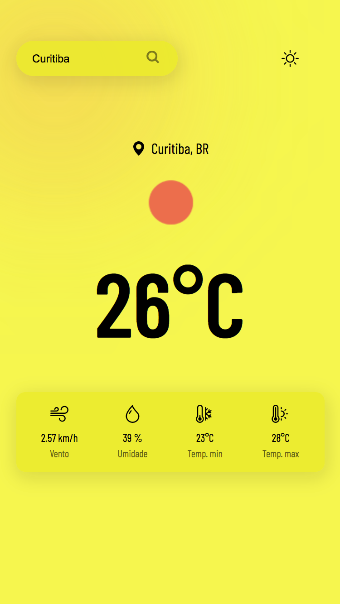
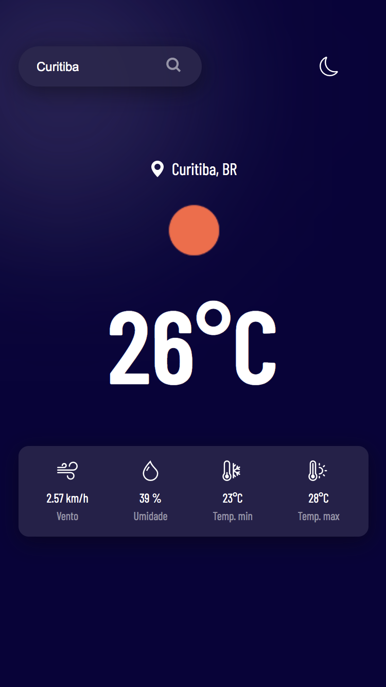

<h1 align="center"> APP CLIMA TEMPO </h1>

<hr>
<br>

<div style="display: flex; gap:10px">
    
    
</div>


## SOBRE O PROJETO:

Projeto de clima tempo, desenvolvido com API(openweathermap). O aplicativo fornece o clima de varias de cidades do mundo, recomendado não utilizar acentuação na pesquisa de cidades!

## LAYOUT

Layout 100% mobile, com tema escuro e claro para melhorar a visualização. Caso a cidade pesquisada não for encontrada ir
irá aparecer mensagem de erro.

## TECNOLOGIAS

- HTML e CSS
- JavaScript
- DOM
- API

## OpenWeather

<a href="https://openweathermap.org/current">Clique aqui</a> e acesse a Documentação da API.

## ACESSE
<a href="https://app-clima-tempo-ten.vercel.app/">Clique aqui</a> e acesse o aplicativo na web.

## CLONE
```bash
git clone https://github.com/paulopariz/app-clima-tempo.git
```

## CONTATO
- paulopariz@gmail.com
<br>
- <a href="https://www.instagram.com/parizpaulo_">parizpaulo_</a>

